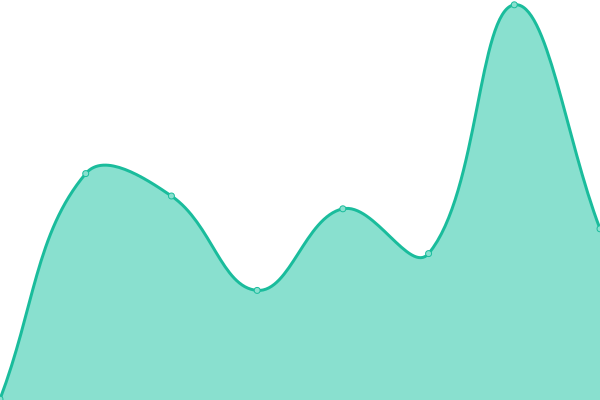

# [📈 Live Status](https://status.r6.hk): <!--live status--> **🟩 All systems operational**

This repository contains the open-source uptime monitor and status page for [Xia Jiacheng](r6.hk), powered by [Upptime](https://github.com/upptime/upptime).

With [Upptime](https://upptime.js.org), you can get your own unlimited and free uptime monitor and status page, powered entirely by a GitHub repository. We use [Issues](https://github.com/r6hk/statuspage/issues) as incident reports, [Actions](https://github.com/r6hk/statuspage/actions) as uptime monitors, and [Pages](https://status.r6.hk) for the status page.

<!--start: status pages-->
<!-- This summary is generated by Upptime (https://github.com/upptime/upptime) -->
<!-- Do not edit this manually, your changes will be overwritten -->
<!-- prettier-ignore -->
| URL | Status | History | Response Time | Uptime |
| --- | ------ | ------- | ------------- | ------ |
|  My Blog | 🟩 Up | [my-blog.yml](https://github.com/r6hk/statuspage/commits/HEAD/history/my-blog.yml) | 

 769ms
     
 | 

<a href="https://status.r6.hk/history/my-blog">100.00%</a>
    

|  [My Blog (use CDN)](https://rennen.dev) | 🟩 Up | [my-blog-use-cdn.yml](https://github.com/r6hk/statuspage/commits/HEAD/history/my-blog-use-cdn.yml) | 

 654ms
     
 | 

<a href="https://status.r6.hk/history/my-blog-use-cdn">100.00%</a>
    

|  [Image Hosting](https://img.rennen.dev) | 🟩 Up | [image-hosting.yml](https://github.com/r6hk/statuspage/commits/HEAD/history/image-hosting.yml) | 

 574ms
     
 | 

<a href="https://status.r6.hk/history/image-hosting">100.00%</a>
    

|  [File Browser](https://file.r6.hk) | 🟩 Up | [file-browser.yml](https://github.com/r6hk/statuspage/commits/HEAD/history/file-browser.yml) | 

 322ms
     
 | 

<a href="https://status.r6.hk/history/file-browser">100.00%</a>
    

|  [Sub Converter](https://sub.r6.hk) | 🟩 Up | [sub-converter.yml](https://github.com/r6hk/statuspage/commits/HEAD/history/sub-converter.yml) | 

 252ms
     
 | 

<a href="https://status.r6.hk/history/sub-converter">99.64%</a>
    

|  [12306 Frontend](https://12306.r6.hk) | 🟩 Up | [12306-frontend.yml](https://github.com/r6hk/statuspage/commits/HEAD/history/12306-frontend.yml) | 

 387ms
     
 | 

<a href="https://status.r6.hk/history/12306-frontend">100.00%</a>
    

|  [12306 Backend](https://12306.r6.hk/api/ticket-service/station/all) | 🟩 Up | [12306-backend.yml](https://github.com/r6hk/statuspage/commits/HEAD/history/12306-backend.yml) | 

 2068ms
     
 | 

<a href="https://status.r6.hk/history/12306-backend">100.00%</a>
    

<!--end: status pages-->

[**Visit our status website →**](https://status.r6.hk)

## 📄 License

- Powered by: [Upptime](https://github.com/upptime/upptime)
- Code: [MIT](./LICENSE) © [Anand Chowdhary](https://anandchowdhary.com), supported by [Pabio](https://pabio.com)
- Data in the `./history` directory: [Open Database License](https://opendatacommons.org/licenses/odbl/1-0/)
